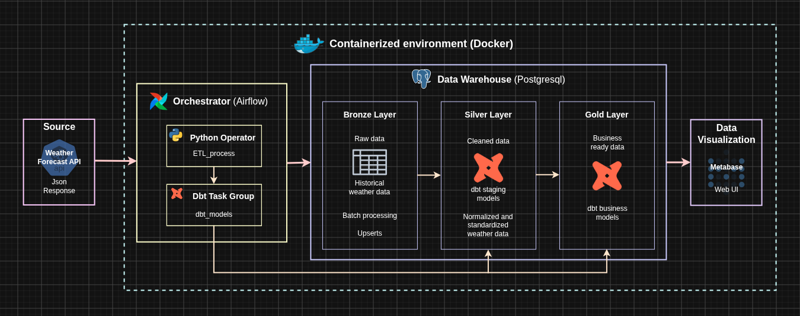

# Weather data pipeline

An end-to-end data pipeline for collecting, transforming, and orchestrating weather data using **Apache Airflow**, **dbt**, and **Docker**.

> **Acknowledgment:** This project was inspired by this [Youtube video](https://www.youtube.com/watch?v=vMgFadPxOLk) by [Calvin Yoon](https://www.youtube.com/@cyprojects)

## Motivation

**Apache Airflow**, **dbt**, and **Docker** are key technologies in the Data Engineering tech stack. The best way to gain proficiency in these tools is through **hands-on practice**. Designing, implementing, and maintaining this project serves as the practical application of these concepts.

## Prerequisites

- **uv**. Python package and project manager.

## API consumed

For this project **Open Meteo's free weather API** was used. You can visit its web site [here](https://open-meteo.com/). I strongly recommend to read its documentation, do it [here](https://open-meteo.com/). No sign up required, no API key is needed.

## Architecture

This project follows the **Medallion Architecture**, and it is **containerized using Docker**.

## Details

### Project database initialization

To avoid *hardcoding* schema and table name in a SQL init file I decided to use a bash script instead. I faced a similar situation while I was working on [this script](https://github.com/DavidMatias44/sql_dwh_project/blob/main/scripts/bronze/run.sh) but in that case the command `sed` was used.

After some research, I found [this Stack Overflow question](https://stackoverflow.com/questions/38800277/what-is-the-eosql-code-block-in-bash-when-running-sql) which helped me solve the issue using the `EOSQL` *limit string*.
