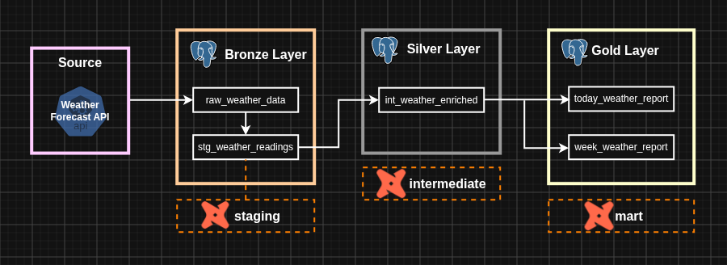

# Weather data pipeline

An end-to-end data pipeline for collecting, transforming, and orchestrating weather data using **Apache Airflow**, **dbt**, and **Docker**.

> **Acknowledgment:** This project was inspired by this [Youtube video](https://www.youtube.com/watch?v=vMgFadPxOLk) by [Calvin Yoon](https://www.youtube.com/@cyprojects)

## Motivation

**Apache Airflow**, **dbt**, and **Docker** are key technologies in the Data Engineering tech stack. The best way to gain proficiency in these tools is through **hands-on practice**. Designing, implementing, and maintaining this project serves as the practical application of these concepts.

## Prerequisites

* **[Docker](https://docs.docker.com/get-docker/)** (v29.7+)
* **[Docker Compose](https://docs.docker.com/compose/install/)** (v5.5+)
* **[uv](https://docs.astral.sh/uv/)** (v0.11+)
* **[Make](https://www.gnu.org/software/make/)** (GNU Make v4.3+, optional)

## API consumed

For this project **Open Meteo's free weather API** was used. You can visit its web site [here](https://open-meteo.com/). I strongly recommend to read its documentation, do it [here](https://open-meteo.com/). No sign up required, no API key is needed.

## Architecture

This project follows the **Medallion Architecture**, and it is **containerized using Docker**.


## Data flow

A diagram to visualize where the data came from, and how it *flows* through the different layers.



## Details

### Project database initialization

To avoid *hardcoding* schema and table name in a SQL init file I decided to use a bash script instead. I faced a similar situation while I was working on [this script](https://github.com/DavidMatias44/sql_dwh_project/blob/main/scripts/bronze/run.sh) but in that case the command `sed` was used.

After some research, I found [this Stack Overflow question](https://stackoverflow.com/questions/38800277/what-is-the-eosql-code-block-in-bash-when-running-sql) which helped me solve the issue using the `EOSQL` *limit string*.

### API response data model

I wanted to validate the format of the API response data as a best practice and correctly handle the weather data in subsequent processes. Pydantic models are a standard solution for archieving this. I learned how to use these models, from the basics to nested models [here](https://pydantic.dev/docs/validation/latest/concepts/models).

### Dockerfile

To orchestrate the ETL pipeline with **Apache Airflow**, the Airflow container must contain all the dependencies required by the `src/main.py` script. 

1. The first step was to list all the dependencies:

```bash
uv pip freeze > requirements.txt
```

2. After that I created a custom Docker image using a Dockerfile. I defined the base image, installed the uv package manager and included the dependencies mentioned before.

3. Finally, I had to modify the `compose.yaml` file to use this custom Docker image.

I have done this before, but reading the official [Docker documentation](https://docs.docker.com/build/concepts/dockerfile/) helped me a lot.

### dbt 

#### Setup

A dbt project must be initialized. After some research, I found the following command to create a container to initialize the project and once it is done delete itself.

```bash
docker run --rm -it  -v "$(pwd)":/usr/app ghcr.io/dbt-labs/dbt-postgres:latest init weather_data_pipeline
```

I had some issues with directory permissions. So I executed this command to solve that:

```bash
sudo chown -R $(id -u):$(id -g) .
```

I ran the `dbt debug` command to ensure dbt was ready to use but it had problems finding the `profiles.yml` file. The solution was to create the file myself. The dbt documentation was really helpful, specifically:

- [This one](https://docs.getdbt.com/docs/local/connect-data-platform/postgres-setup?version=2#profile-configuration) helped me to understand the content of the `profiles.yml` file.

- And [this one](https://docs.getdbt.com/reference/dbt-jinja-functions/env_var?version=2#using-the-env-file) helped me properly use my `.env` file to avoid hardcoding some values in it.

#### Models

The `models` directory follows the official dbt [structure and naming conventions](https://docs.getdbt.com/best-practices/how-we-structure/1-guide-overview?version=2). 

The SQL code within these models is styled according to the dbt [SQL style guide](https://docs.getdbt.com/best-practices/how-we-style/2-how-we-style-our-sql?version=2).

#### Orchestration

The Cosmos package is used to orchestrate the dbt models. This packages simplifies considerably the setup and execution process for dbt workflows.

The implementation follows the main steps described in this [Medium blog post](https://medium.com/@wajahatullah.k/running-dbt-on-postgresql-with-the-cosmos-package-airflow-904256044db1).
