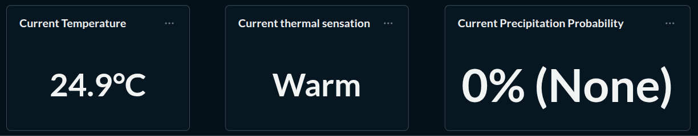
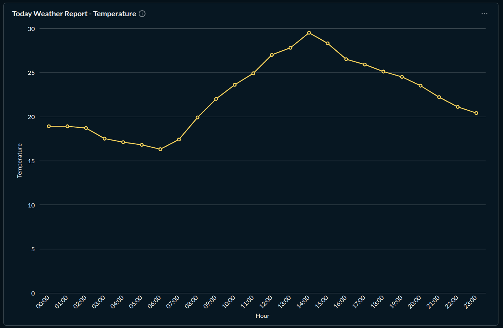
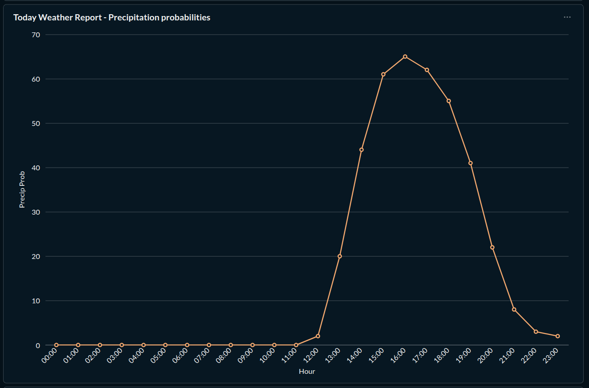
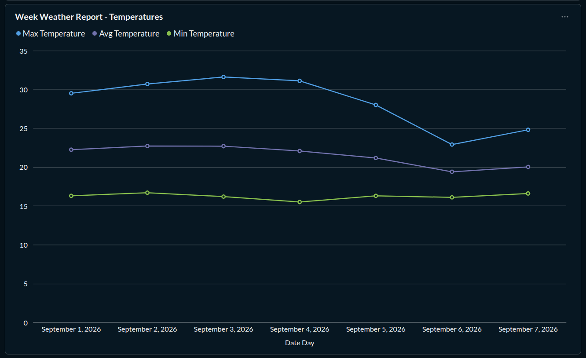
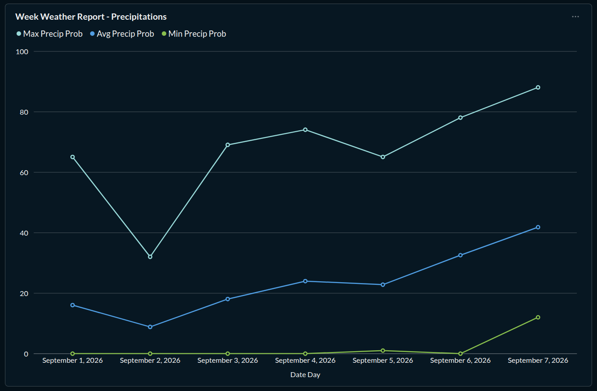

# Metabase Dashboard

The final layer of the weather data pipeline is visualized using **Metabase**.

## Dashboard Layout

### 1. Current information

Summary of current meteorological conditions utilizing records from the mart layer.

* **Current Temperature:** Displays the current temperature in degrees Celsius.

* **Current Thermal Sensation:** Categorizes the temperature (e.g., *Warm*, *Comfortable*) using transformed business logic from the intermediate layer.

* **Current Precipitation Probability:** Shows the exact percentage alongside its qualitative categorical risk level.

### 2. Today's Weather Progression

Visualizes the hourly breakdown of temperature and precipitation probability for the current date.

### 3. Weekly Temperature Trends

Tracks maximum, average, and minimum temperatures and precipitation probabilities across a 7-day rolling window.

